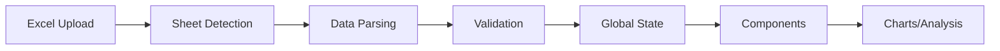

# DataRabbit - Technical Stack Brief

## 🎯 **Software Overview**

DataRabbit is a **React-TypeScript web application** for hydroponic vertical farming analytics. It processes Excel sensor data from 3 agricultural parcels (P1-Almácigo, P2-Engorda, P3-Desarrollo) to provide real-time environmental analysis, production correlations, and yield optimization insights for agricultural engineers.

---

## 🛠️ **Core Technology Stack**

### **Frontend Framework**
- **React 18.2.0** - Component-based UI library
- **TypeScript 4.8.3** - Type safety and enhanced development experience
- **Create React App** - Build toolchain and development server

### **UI & Styling**
- **Tailwind CSS 3.3.3** - Utility-first CSS framework
- **Lucide React 0.263.1** - Modern icon library
- **Responsive Design** - Mobile and desktop compatibility

### **Data Visualization**
- **Recharts 2.8.0** - React charting library
- **Chart Types**: Line charts, bar charts, scatter plots, heat maps
- **Performance**: Optimized for 30K+ data points per chart

### **Data Processing**
- **Papa Parse 5.4.1** - CSV parsing and processing
- **XLSX 0.18.5** - Excel file reading and multi-sheet handling
- **Date-fns 2.29.3** - Date manipulation and formatting

### **State Management**
- **React Context API** - Global state management
- **React Hooks** - Component state and side effects
- **Custom Hooks** - Reusable state logic (usePersistentState, useParcelContext)

### **Development Tools**
- **Jest** - Unit testing framework
- **React Testing Library** - Component testing utilities
- **ESLint** - Code quality and consistency
- **Prettier** - Code formatting

---

## 📊 **Data Architecture**

### **Input Data Sources**
```typescript
// Primary Excel files
- dataSemanal.xlsx    // Multi-sheet sensor data (P1, P2, P3)
- dataProduccion.xlsx // Production/harvest data

// Data Resolution
- 5-minute sensor readings
- Weekly production metrics
- 15-30 weeks per dataset
- ~30,000 records per parcel
```

### **Core Data Types**
```typescript
interface SensorRecord {
  timestamp: Date;
  week: number;
  year: number;
  parcelId: 'P1' | 'P2' | 'P3';
  islands: {
    [islandId: string]: {
      temperature: number | null;    // °C
      humidity: number | null;       // %
      vpd: number | null;           // kPa (Vapor Pressure Deficit)
      lights: 0 | 1 | null;        // ON/OFF status
    };
  };
  co2: number | null;              // ppm
}

interface ProductionRecord {
  week: number;
  year: number;
  variety: string;                 // "Lechuga Romana", "Albahaca Genovesa"
  metrics: {
    rendimiento: number;           // g/m² (yield)
    bandejas: number;             // tray count
    eficiencia: number;           // efficiency %
    gPorPlanta: number;           // grams per plant
  };
}
```

---

## 🏗️ **Application Architecture**

### **Project Structure**
```
src/
├── components/           # React components
│   ├── Dashboard/       # Executive dashboard
│   ├── Analysis/        # Weekly analysis
│   ├── Charts/          # Reusable chart components
│   └── Upload/          # File upload handling
├── contexts/            # React Context providers
├── hooks/              # Custom React hooks
├── utils/              # Data processing utilities
│   ├── dataProcessor.ts
│   ├── excelProcessor.ts
│   └── analysisEngine.ts
├── types/              # TypeScript type definitions
└── config/             # Configuration files
```

### **Key Features**
1. **Multi-Sheet Excel Processing** - Handles 3+ sheets per file
2. **Real-Time Analysis** - Environmental parameter monitoring
3. **Multi-Parcel Comparison** - Side-by-side analysis
4. **Production Correlation** - 6-week cycle environment→yield mapping
5. **Independent Components** - Each tab is self-contained
6. **Performance Optimized** - Handles large datasets efficiently

---

## 🔄 **Data Flow**



### **Processing Pipeline**
1. **File Upload** → Multi-sheet Excel detection
2. **Parsing** → Convert to TypeScript objects
3. **Validation** → Data quality checks
4. **State Management** → Global context updates
5. **Analysis** → Statistical calculations
6. **Visualization** → Recharts rendering

---

## ⚡ **Performance Specifications**

### **Target Performance**
- **Initial Load**: <3 seconds
- **Tab Switching**: <200ms
- **Chart Rendering**: 60fps interactions
- **File Processing**: 50MB Excel in <5 seconds

### **Optimization Strategies**
- **React.memo()** for expensive components
- **useMemo()** for heavy calculations
- **Lazy loading** for large datasets
- **Data pagination** for charts
- **Background processing** for file parsing

---

## 🌱 **Agricultural Domain Context**

### **Parcel System**
- **P1 (Almácigo)**: Seedling stage, 4-6 islands
- **P2 (Engorda)**: Growth stage, 6 islands  
- **P3 (Desarrollo)**: Development stage, 6 islands

### **Environmental Parameters**
- **Temperature**: 18-25°C optimal range
- **Humidity**: 60-75% optimal range
- **VPD**: 0.8-1.3 kPa optimal range
- **Light Schedule**: Day/night cycles
- **CO2**: 400-1200 ppm range

### **Crops**
- **Lechuga (Lettuce)**: Primary crop, various varieties
- **Albahaca (Basil)**: Secondary crop, specific requirements

---

## 🚀 **Development Commands**

### **Essential Scripts**
```bash
# Development
npm run start-dynamic    # Recommended development server
npm start               # Alternative development server

# Build
npm run build-dynamic   # Production build (recommended)
npm run build          # Alternative production build

# Testing
npm test               # Run test suite
npm run test:coverage  # Test with coverage report
```

### **Environment Setup**
```bash
# Node.js requirements
Node.js >= 16.x
npm >= 8.x

# Installation
npm install

# Environment variables (optional)
REACT_APP_ENTRY=dynamic          # Use dynamic mode
REACT_APP_USE_LEGACY=false       # Use modern architecture
```

---

## 🔧 **Development Best Practices**

### **Code Style**
- **TypeScript strict mode** enabled
- **No `any` types** except for legacy compatibility
- **Comprehensive error handling** for all data operations
- **Agricultural domain terminology** in code and UI
- **Bilingual support** (Spanish/English)

### **Component Patterns**
```typescript
// Typical component structure
interface ComponentProps {
  data: SensorRecord[];
  config: ParcelConfig;
  onAnalysisUpdate?: (analysis: WeeklyAnalysis) => void;
}

const Component: React.FC<ComponentProps> = ({ data, config }) => {
  // Component logic
  const analysis = useMemo(() => analyzeData(data, config), [data, config]);
  
  return (
    <div className="component-container">
      {/* Component JSX */}
    </div>
  );
};
```

### **Data Processing Pattern**
```typescript
// Standard data processing approach
const processData = (rawData: any[], parcelConfig: ParcelConfig) => {
  return rawData
    .filter(row => validateRow(row))
    .map(row => transformRow(row, parcelConfig))
    .filter(record => record !== null);
};
```

---

## 📝 **Integration Guidelines**

### **For New Modules**
1. **Follow existing patterns** - Use established TypeScript interfaces
2. **Agricultural focus** - Understand the farming context
3. **Performance first** - Consider large dataset implications
4. **Error handling** - Graceful degradation for missing data
5. **Testing** - Include unit tests for data processing functions

### **State Integration**
```typescript
// Access global state
const { sensorData, productionData, parcelConfigs } = useParcelContext();

// Update global state
const updateParcelData = (parcelId: string, data: SensorRecord[]) => {
  // State update logic
};
```

### **Component Integration**
- Use existing **Tailwind CSS** classes for consistency
- Follow **Recharts** patterns for data visualization
- Implement **responsive design** for mobile compatibility
- Include **loading states** and **error boundaries**

---

This technical brief provides everything needed to develop compatible modules for the DataRabbit agricultural analytics platform.