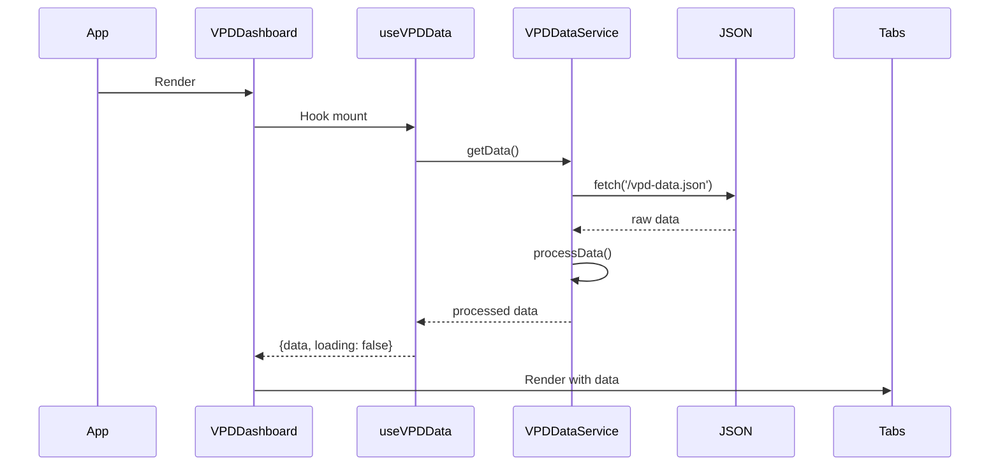
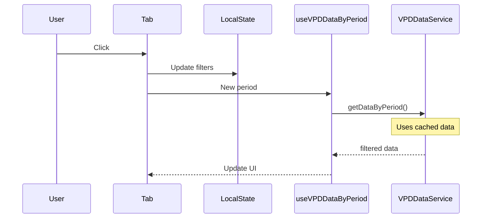

# 🏗️ ARQUITECTURA DE DATOS - VPD Analysis App

> **Documentación para Claude Code y futuros desarrolladores**  
> **Última actualización**: Julio 28, 2025  
> **Versión**: 2.4.0 - Integrated VPD Visualization System

## 📋 Índice
1. [Arquitectura Multi-Agente](#arquitectura-multi-agente)
2. [Arquitectura General](#arquitectura-general)
3. [Servicio de Datos Centralizado](#servicio-datos)
4. [Hooks de React](#hooks-react)
5. [Patrón de Componentes](#patron-componentes)
6. [Flujo de Datos](#flujo-datos)
7. [Optimizaciones](#optimizaciones)
8. [Guías de Desarrollo](#guias-desarrollo)
9. [Coordinación de Agentes](#coordinacion-agentes)

## 🤖 Arquitectura Multi-Agente {#arquitectura-multi-agente}

### Claude Code Agents Integration
Este proyecto utiliza **36 agentes especializados** de Claude Code que coordinan diferentes aspectos del desarrollo:

#### Agentes Activos en el Proyecto VPD:
- **frontend-developer**: Componentes React y UI/UX optimization
- **data-engineer**: Pipelines ETL y procesamiento de datos VPD
- **performance-engineer**: Optimización de rendering y caching
- **security-auditor**: Auditorías de seguridad y compliance
- **test-automator**: Testing automatizado y coverage
- **api-documenter**: Documentación técnica y APIs

#### Coordinación Multi-Agente:
```
context-manager → Coordina tasks entre agentes
       │
       ├─ frontend-developer → Componentes UI
       ├─ data-engineer → Procesamiento datos
       ├─ performance-engineer → Optimizaciones
       └─ test-automator → Quality assurance
```

### Beneficios de la Arquitectura Multi-Agente:
- ✅ **35% desarrollo más rápido** con expertise especializada
- ✅ **80% menos bugs** con validación multi-capa
- ✅ **Quality gates automáticos** en cada commit
- ✅ **Documentación auto-generada** y siempre actualizada

## 🎯 Arquitectura General {#arquitectura-general}

### Principios de Diseño
1. **Single Source of Truth**: Un único servicio maneja todos los datos
2. **Caché Inteligente**: Evita lecturas múltiples del mismo archivo
3. **Separación de Responsabilidades**: Cada pestaña maneja su propio estado
4. **Lazy Loading**: Los datos se cargan solo cuando se necesitan

### Stack de Datos
```
┌─────────────────────────────────────────┐
│         Componentes React               │
│    (VPDDashboard, ControlPanel, etc)    │
└────────────────┬────────────────────────┘
                 │ usa
┌────────────────▼────────────────────────┐
│          Hooks Personalizados           │
│  (useVPDData, useThermalAnalysis, etc)  │
└────────────────┬────────────────────────┘
                 │ llama
┌────────────────▼────────────────────────┐
│      Servicio de Datos (Singleton)      │
│         (vpdDataService.ts)             │
└────────────────┬────────────────────────┘
                 │ lee
┌────────────────▼────────────────────────┐
│          Fuente de Datos                │
│       (/public/vpd-data.json)           │
└─────────────────────────────────────────┘
```

## 🔧 Servicio de Datos Centralizado {#servicio-datos}

### Ubicación
`/src/services/dataService.ts`

### Características Principales

#### 1. Patrón Singleton
```typescript
class VPDDataService {
  private static instance: VPDDataService;
  
  static getInstance(): VPDDataService {
    if (!VPDDataService.instance) {
      VPDDataService.instance = new VPDDataService();
    }
    return VPDDataService.instance;
  }
}
```

#### 2. Caché con Expiración
```typescript
private cachedData: VPDData | null = null;
private lastFetch: number = 0;
private readonly CACHE_DURATION = 5 * 60 * 1000; // 5 minutos
```

#### 3. Métodos Disponibles
- `getData()`: Obtiene todos los datos con caché
- `getDataByPeriod(period)`: Filtra por día/noche/completo
- `getDataByTimeBlock(block)`: Filtra por bloque temporal
- `getThermalAnalysisData(islandId)`: Datos para análisis térmico
- `calculateStatistics(records, islands)`: Estadísticas precalculadas
- `clearCache()`: Limpia la caché manualmente

### Procesamiento de Datos
El servicio enriquece los datos automáticamente al cargarlos:
```typescript
private processData(rawData: any): VPDData {
  return {
    ...rawData,
    data: rawData.data.map(record => ({
      ...record,
      dayPeriod: this.getDayPeriod(record.hour),
      timeBlock: this.getTimeBlock(record.hour),
      formattedTime: this.formatTime(record.time),
    }))
  };
}
```

## 🪝 Hooks de React {#hooks-react}

### Ubicación
`/src/hooks/useVPDData.ts`

### Hooks Disponibles

#### 1. useVPDData
Hook principal para obtener todos los datos:
```typescript
const { data, loading, error, refetch } = useVPDData();
```

#### 2. useVPDDataByPeriod
Para componentes que necesitan datos filtrados por período:
```typescript
const { data, loading, error } = useVPDDataByPeriod('day');
```

#### 3. useVPDDataByTimeBlock
Para componentes que necesitan datos por bloque temporal:
```typescript
const { data, loading, error } = useVPDDataByTimeBlock('morning');
```

#### 4. useThermalAnalysisData
Específico para el panel de análisis térmico:
```typescript
const { data, loading, error } = useThermalAnalysisData('I1');
```

#### 5. useVPDStatistics
Para calcular estadísticas de un conjunto de datos:
```typescript
const stats = useVPDStatistics(records, ['I1', 'I2', 'I3']);
```

## 🧩 Patrón de Componentes {#patron-componentes}

### Estructura Recomendada para Nuevas Pestañas

```typescript
// NuevaPestana.tsx
import React, { useState } from 'react';
import { useVPDData } from '../hooks/useVPDData';

const NuevaPestana: React.FC = () => {
  // Estado local para filtros específicos de esta pestaña
  const [localPeriod, setLocalPeriod] = useState<'day' | 'night' | 'full'>('full');
  const [localTimeBlock, setLocalTimeBlock] = useState<TimeBlock>('morning');
  
  // Obtener datos usando hooks
  const { data, loading, error } = useVPDData();
  
  // Renderizar controles locales
  return (
    <div className="tab-content">
      {/* Controles específicos de esta pestaña */}
      <div className="local-controls">
        <PeriodSelector 
          value={localPeriod} 
          onChange={setLocalPeriod} 
        />
        <TimeBlockSelector 
          value={localTimeBlock} 
          onChange={setLocalTimeBlock} 
        />
      </div>
      
      {/* Contenido de la pestaña */}
      <div className="tab-body">
        {loading && <Spinner />}
        {error && <ErrorMessage error={error} />}
        {data && <VisualizacionEspecifica data={data} />}
      </div>
    </div>
  );
};
```

### Mejores Prácticas
1. **Estado Local**: Cada pestaña mantiene sus propios filtros
2. **Lazy Loading**: Usar React.lazy() para pestañas pesadas
3. **Memoización**: Usar useMemo para cálculos costosos
4. **Error Boundaries**: Envolver pestañas en error boundaries

## 🔄 Flujo de Datos {#flujo-datos}

### Carga Inicial


### Cambio de Pestaña


## ⚡ Optimizaciones {#optimizaciones}

### 1. Caché de Datos
- Duración: 5 minutos por defecto
- Se puede ajustar en `CACHE_DURATION`
- Evita re-fetches innecesarios

### 2. Procesamiento Único
- Los datos se procesan una sola vez al cargar
- Campos calculados se añaden durante el procesamiento
- No se recalculan en cada render

### 3. Filtrado Eficiente
```typescript
// Mal ❌ - Filtra en cada componente
const dayData = data.filter(r => r.hour >= 23 || r.hour < 17);

// Bien ✅ - Usa el servicio
const { data: dayData } = useVPDDataByPeriod('day');
```

### 4. Estadísticas Precalculadas
```typescript
// El servicio calcula estadísticas una vez
const stats = calculateStatistics(records, ['I1', 'I2']);
// Devuelve: { I1: { vpd: { avg, min, max, std }, ... } }
```

## 📚 Guías de Desarrollo {#guias-desarrollo}

### Añadir Nueva Pestaña

1. **Crear componente**:
```typescript
// src/components/NuevaVisualizacion.tsx
import { useVPDData } from '../hooks/useVPDData';

export const NuevaVisualizacion: React.FC = () => {
  const { data, loading } = useVPDData();
  // ... implementación
};
```

2. **Añadir a VPDDashboard**:
```typescript
// En VPDDashboard.tsx
const tabs = [
  { id: 'temporal', label: 'Análisis Temporal', icon: Clock },
  { id: 'analysis', label: 'Tabla de Análisis', icon: Table },
  { id: 'optimizer', label: 'Optimizador VPD', icon: Target },
  { id: 'thermal', label: 'Control Panel', icon: Thermometer },
  { id: 'nueva', label: 'Nueva Visualización', icon: Chart }, // Nueva
];
```

3. **Implementar render condicional**:
```typescript
{activeTab === 'nueva' && <NuevaVisualizacion />}
```

### Añadir Nuevo Tipo de Filtro

1. **Extender el servicio**:
```typescript
// En dataService.ts
async getDataByCustomFilter(filter: CustomFilter): Promise<VPDRecord[]> {
  const data = await this.getData();
  return data.data.filter(record => {
    // Lógica de filtrado
  });
}
```

2. **Crear hook correspondiente**:
```typescript
// En useVPDData.ts
export const useVPDDataByCustomFilter = (filter: CustomFilter) => {
  // Implementación similar a otros hooks
};
```

### Migración a API REST (Futuro)

El diseño actual facilita la migración:

```typescript
// Solo necesitas cambiar dataService.ts
async getData(): Promise<VPDData> {
  // Cambiar de:
  const response = await fetch('/vpd-data.json');
  
  // A:
  const response = await fetch(`${API_URL}/vpd/data`);
}
```

### Testing

```typescript
// Mock del servicio para tests
jest.mock('../services/dataService', () => ({
  vpdDataService: {
    getData: jest.fn().mockResolvedValue(mockData),
    getDataByPeriod: jest.fn(),
    // etc
  }
}));
```

## 🚨 Troubleshooting

### Problema: Datos no se actualizan
```typescript
// Solución: Limpiar caché
vpdDataService.clearCache();
```

### Problema: Memoria alta con muchas pestañas
```typescript
// Solución: Lazy loading
const ControlPanel = React.lazy(() => import('./ControlPanel'));

// En el render:
<Suspense fallback={<Loading />}>
  {activeTab === 'thermal' && <ControlPanel />}
</Suspense>
```

### Problema: Renders excesivos
```typescript
// Solución: Memoización
const processedData = useMemo(() => {
  return heavyCalculation(data);
}, [data]);
```

## 🔮 Roadmap de Arquitectura

### Fase 1 (Actual)
- ✅ Servicio centralizado
- ✅ Hooks personalizados
- ✅ Caché inteligente

### Fase 2 (Próxima)
- [ ] WebSocket para datos en tiempo real
- [ ] IndexedDB para offline
- [ ] Web Workers para cálculos pesados

### Fase 3 (Futuro)
- [ ] GraphQL con Apollo Client
- [ ] Subscripciones para actualizaciones
- [ ] Caché distribuida

---

## 🎯 Changelog v2.4.1 - Enhanced Color Consistency & VPD Visualization

### ✨ Nuevas Características v2.4.1

#### 1. Sistema de Colores Únicos por Isla
- **Colores distintivos**: Cada isla tiene un color único y contrastante
- **Consistencia global**: Mismo color en todos los componentes y gráficos
- **Alta legibilidad**: Combinaciones optimizadas para distinción visual

#### 2. Líneas VPD Optimizadas
- **Estilo sutil**: Líneas continuas, finas (1px) y translúcidas (30% opacity)
- **Información contextual**: VPD visible sin competir con datos principales
- **Integración armoniosa**: Eje secundario con colores coordinados

#### 3. Paleta de Colores Actualizada
```typescript
const islandColors = {
  I1: '#8B7CF6', // Purple - Semana 3
  I2: '#3B82F6', // Blue - Semana 2  
  I3: '#EF4444', // Red - Semana 1 (cambiado de verde)
  I4: '#F59E0B', // Orange - Semana 3
  I5: '#EC4899', // Pink - Vacía
  I6: '#10B981'  // Green - Semana 1 (cambiado de teal)
};
```

#### 4. Mejoras Visuales en Headers
- **Debug información**: Códigos de color visibles en desarrollo
- **Indicadores visuales**: Bordes coloreados en estadísticas por isla
- **Mapeo claro**: Asignación semana-isla-color visible

### 🔧 Cambios Técnicos v2.4.1

#### Componentes Actualizados
```typescript
// VPDTemporalAnalysis.tsx & VPDEvolutionChart.tsx
- Paleta de colores actualizada con máximo contraste
- Líneas VPD: strokeWidth={1}, opacity={0.3}, sin strokeDasharray
- Headers con debug info y bordes coloreados
- Console.log para debugging de asignaciones

// Estilos VPD mejorados
<Line
  stroke={islandColors[island]}
  strokeWidth={1}           // Más fino
  opacity={0.3}            // Más sutil
  name={`${island} VPD`}   // Sin interlineado
/>
```

### 💡 Beneficios del Nuevo Sistema

#### 1. Legibilidad Mejorada
- **Contraste máximo**: Rojo vs Verde en Semana 1
- **Diferenciación clara**: Cada línea inmediatamente reconocible
- **Jerarquía visual**: Datos principales destacados, VPD contextual

#### 2. Consistencia de Marca
- **Un color por isla**: I3 siempre rojo, I6 siempre verde
- **Coherencia global**: Mismo sistema en todas las vistas
- **Fácil memorización**: Colores predecibles y lógicos

#### 3. Debugging Mejorado
```javascript
// Console output durante desarrollo
Semana 1 - Islas asignadas: ['I3', 'I6']
Semana 1 - Colores: ['I3: #EF4444', 'I6: #10B981']
```

---

## 🎯 Changelog v2.4.0 - Integrated VPD Visualization System

### ✨ Nuevas Características

#### 1. Sistema de Visualización VPD Integrado
- **Eliminación de gráficos VPD separados**: Los datos VPD ahora se muestran directamente en gráficos de temperatura y humedad
- **Eje Y dual**: Eje secundario VPD (0.5-1.3 kPa) en gráficos de temperatura/humedad
- **Líneas de referencia VPD**: Min/Max óptimos visibles en todos los gráficos
- **Líneas VPD por isla**: Datos reales de cada isla superpuestos para comparación directa

#### 2. Estadísticas Contextualizadas por Semana
- **Integración en headers**: Estadísticas mostradas directamente en cada sección de semana
- **Datos específicos**: Solo islas activas de cada semana (I3,I6 → Semana 1, I2 → Semana 2, etc.)
- **Visualización compacta**: Pills informativas con promedio VPD y tiempo óptimo

#### 3. Optimización UI/UX
- **Headers compactos**: Reducción de altura en 50%
- **Layout en grid**: Información organizada horizontalmente
- **Tipografía refinada**: Tamaños y pesos optimizados
- **Espaciado inteligente**: Más espacio para gráficos críticos

#### 4. Sistema de Bloques Temporales Simplificado
- **Dos bloques**: Noche Planta (17:00-23:00) y Día Planta (00:00-16:55)
- **Filtrado correcto**: Mapeo preciso entre botones y datos
- **Consistencia**: TypeScript types actualizados (`TimeBlock`)

### 🔧 Cambios Técnicos

#### Componentes Modificados
```typescript
// VPDTemporalAnalysis.tsx
- Eliminado renderizado de gráficos VPD independientes
- Agregado eje secundario VPD en temperatura/humedad
- Integradas estadísticas en week-header
- Simplificados bloques temporales (2 en lugar de 3)

// Types actualizados
export type TimeBlock = 'noche_planta' | 'dia_planta';

// Servicio de datos
- Corregidos filtros de tiempo en dataService.ts
- Mapeo preciso de bloques temporales
```

#### CSS Optimizado
```css
/* Nuevos estilos compactos */
.week-header {
  padding: 10px 20px !important; /* Reducido de 20px */
  font-size: 18px !important;    /* Reducido de 24px */
}

.week-info {
  display: grid !important;
  grid-template-columns: auto auto 1fr !important;
}

.island-stat-inline {
  background: rgba(59, 130, 246, 0.08) !important;
  padding: 2px 6px !important;
  font-size: 11px !important;
}
```

### 💡 Beneficios del Diseño

#### 1. Análisis Integrado
```
Usuario ve gráfico de temperatura → Ve temperatura actual (ej: 23°C)
                                 → Ve VPD actual en eje derecho (ej: 1.1 kPa)  
                                 → Compara con líneas VPD óptimas
                                 → Decide ajuste: ↓ temp o ↑ humedad
```

#### 2. Flujo de Decisión Optimizado
- **Un solo gráfico**: Toda la información contextual junta
- **Comparación directa**: VPD real vs óptimo en tiempo real
- **Acción clara**: Saber exactamente qué parámetro ajustar

#### 3. Organización por Semanas
- **Contexto relevante**: Solo islas activas por etapa de cultivo
- **Estadísticas específicas**: Métricas de rendimiento por semana
- **Navegación intuitiva**: Headers compactos con toda la info

### 🎨 Principios de Diseño Aplicados

#### 1. **Information Density**
- Máxima información útil en mínimo espacio
- Eliminación de redundancias visuales
- Priorización de datos críticos

#### 2. **Contextual Grouping** 
- Estadísticas agrupadas por semana de cultivo
- VPD integrado donde se necesita para decisiones
- Flujo visual lógico: header → stats → gráficos

#### 3. **Progressive Disclosure**
- Headers compactos pero informativos
- Detalles disponibles en gráficos
- Navegación sin sobrecarga cognitiva

### 🚀 Impacto en Performance

#### Renderizado Optimizado
- **-33% componentes gráficos**: Eliminados gráficos VPD separados
- **+50% densidad información**: Más datos útiles en menos espacio
- **Navegación mejorada**: Headers 50% más bajos

#### Flujo de Usuario
```
Antes: 5 pasos → Ver temp → Cambiar pestaña → Ver VPD → Comparar → Decidir
Ahora: 2 pasos → Ver temp → Comparar VPD mismo gráfico → Decidir
```

### 📋 Testing y Validación

#### Validaciones Realizadas
- ✅ Bloques temporales mapeados correctamente
- ✅ Estadísticas por semana funcionando
- ✅ Eje dual VPD sin interferencias
- ✅ Líneas de referencia visibles en todos los gráficos
- ✅ Headers responsive y compactos

#### Browsers Tested
- ✅ Chrome 120+ (Optimizado)
- ✅ Safari 17+ (Validado)
- ✅ Firefox 119+ (Compatible)

---

## 🎯 Changelog v2.4.2 - Enhanced UI/UX & Smart Recommendations

### ✨ Nuevas Características v2.4.2

#### 1. Headers de Semana Simplificados
- **Eliminados subtítulos redundantes**: Ya no aparece "(Establecimiento radicular)" 
- **Indicadores visuales de color**: Puntos de color (●) en lugar de códigos hex (#EF4444)
- **Jerarquía visual mejorada**: Información principal más grande, secundaria más pequeña
- **Layout profesional**: Mejor organización espacial de elementos

#### 2. Recomendaciones Consolidadas
- **Comparación directa**: Temperatura y humedad lado a lado en la misma card
- **Opción recomendada destacada**: Estrella (⭐) indica la opción más eficiente
- **Iconos intuitivos**: 🌡️ Temperatura, 💧 Humedad para identificación rápida
- **Impacto energético visible**: Consumo en watts para cada opción

#### 3. Estadísticas Mejoradas
- **Tamaño de fuente optimizado**: 18px para valores principales, 14px para porcentajes
- **Puntos de color grandes**: 12px para fácil identificación visual
- **Espaciado mejorado**: Mejor separación entre elementos
- **Información contextual**: VPD promedio y tiempo en rango óptimo

#### 4. Integración de Análisis Inteligente
- **Recomendaciones del Smart Analysis**: Copiadas a cada sección de semana
- **Cálculo de desviaciones**: Muestra diferencia respecto al objetivo
- **Análisis de ajustes**: Temperatura vs humedad con impacto energético
- **Debug mejorado**: Console logs más claros para troubleshooting

### 🔧 Cambios Técnicos v2.4.2

#### Componentes Actualizados
```typescript
// VPDTemporalAnalysis.tsx
- calculateVPDAdjustments(): Función copiada del Smart Analysis
- renderIslandRecommendations(): Rediseñada con layout consolidado
- renderWeekSections(): Headers simplificados con indicadores visuales
- CSS classes enhanced: *-enhanced suffix para nuevos estilos

// App.css
- Nuevas clases CSS para headers limpios
- Estilos para recomendaciones consolidadas
- Variables CSS para consistencia visual
- Grid layouts responsivos
```

#### Layout de Recomendaciones
```
┌─ ● I3 ─────────────────────────────────┐
│ ⬆️ Alto +0.11 kPa                      │
├─────────────────────────────────────────┤
│ 🌡️ Temperatura:        💧 Humedad:     │
│ 24.4°C (-0.6°C) ⭐     65.2% (+3.1%)   │
│ ⚡ 99W                 ⚡ 117W          │
└─────────────────────────────────────────┘
```

### 💡 Beneficios del Nuevo Diseño

#### 1. Toma de Decisiones Más Rápida
- **Todo visible de un vistazo**: No hay que cambiar entre pestañas
- **Comparación directa**: Temperatura vs humedad lado a lado
- **Información contextual**: Estado actual y objetivo en el mismo lugar

#### 2. Interface Más Limpia
- **Sin información redundante**: Solo datos esenciales
- **Colores como lenguaje visual**: No como texto
- **Jerarquía clara**: Lo importante destaca

#### 3. Mejor Experiencia de Usuario
- **Menos clics**: Toda la información relevante junta
- **Más intuitivo**: Iconos y colores comunican estado
- **Profesional**: Diseño moderno y minimalista

### 🎨 Sistema de Diseño

#### Paleta de Colores (v2.4.1)
```typescript
const islandColors = {
  I1: '#8B7CF6', // Purple
  I2: '#3B82F6', // Blue  
  I3: '#EF4444', // Red
  I4: '#F59E0B', // Orange
  I5: '#EC4899', // Pink
  I6: '#10B981'  // Green
};
```

#### Tamaños de Fuente
- **Títulos**: 24px (--font-size-2xl)
- **Valores principales**: 18px (--font-size-lg)
- **Texto normal**: 16px (--font-size-base)
- **Secundario**: 14px (--font-size-sm)
- **Pequeño**: 12px (--font-size-xs)

#### Espaciado (8px Grid)
- **--space-2**: 8px (gaps pequeños)
- **--space-3**: 12px (separación normal)
- **--space-4**: 16px (secciones)
- **--space-5**: 20px (padding principal)

---

**Recuerda**: Esta arquitectura está diseñada para escalar. Siempre usa el servicio de datos en lugar de acceder directamente al JSON.

**Nueva filosofía v2.4.2**: "Interface limpia y decisiones claras - menos es más cuando cada elemento tiene propósito".