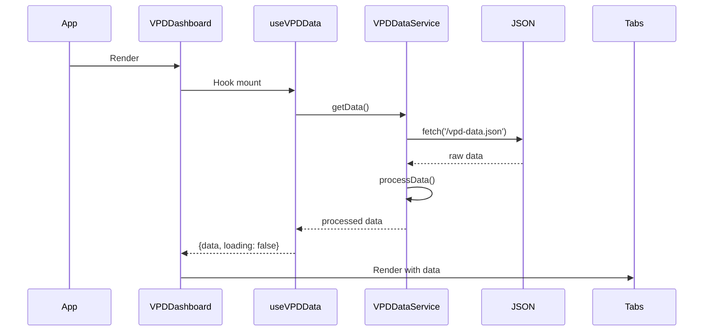
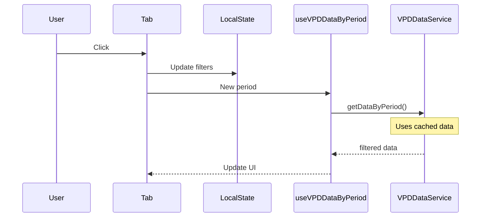

# 🏗️ ARQUITECTURA DE DATOS - VPD Analysis App

> **Documentación para Claude Code y futuros desarrolladores**  
> **Última actualización**: Julio 25, 2025

## 📋 Índice
1. [Arquitectura General](#arquitectura-general)
2. [Servicio de Datos Centralizado](#servicio-datos)
3. [Hooks de React](#hooks-react)
4. [Patrón de Componentes](#patron-componentes)
5. [Flujo de Datos](#flujo-datos)
6. [Optimizaciones](#optimizaciones)
7. [Guías de Desarrollo](#guias-desarrollo)

## 🎯 Arquitectura General {#arquitectura-general}

### Principios de Diseño
1. **Single Source of Truth**: Un único servicio maneja todos los datos
2. **Caché Inteligente**: Evita lecturas múltiples del mismo archivo
3. **Separación de Responsabilidades**: Cada pestaña maneja su propio estado
4. **Lazy Loading**: Los datos se cargan solo cuando se necesitan

### Stack de Datos
```
┌─────────────────────────────────────────┐
│         Componentes React               │
│    (VPDDashboard, ControlPanel, etc)    │
└────────────────┬────────────────────────┘
                 │ usa
┌────────────────▼────────────────────────┐
│          Hooks Personalizados           │
│  (useVPDData, useThermalAnalysis, etc)  │
└────────────────┬────────────────────────┘
                 │ llama
┌────────────────▼────────────────────────┐
│      Servicio de Datos (Singleton)      │
│         (vpdDataService.ts)             │
└────────────────┬────────────────────────┘
                 │ lee
┌────────────────▼────────────────────────┐
│          Fuente de Datos                │
│       (/public/vpd-data.json)           │
└─────────────────────────────────────────┘
```

## 🔧 Servicio de Datos Centralizado {#servicio-datos}

### Ubicación
`/src/services/dataService.ts`

### Características Principales

#### 1. Patrón Singleton
```typescript
class VPDDataService {
  private static instance: VPDDataService;
  
  static getInstance(): VPDDataService {
    if (!VPDDataService.instance) {
      VPDDataService.instance = new VPDDataService();
    }
    return VPDDataService.instance;
  }
}
```

#### 2. Caché con Expiración
```typescript
private cachedData: VPDData | null = null;
private lastFetch: number = 0;
private readonly CACHE_DURATION = 5 * 60 * 1000; // 5 minutos
```

#### 3. Métodos Disponibles
- `getData()`: Obtiene todos los datos con caché
- `getDataByPeriod(period)`: Filtra por día/noche/completo
- `getDataByTimeBlock(block)`: Filtra por bloque temporal
- `getThermalAnalysisData(islandId)`: Datos para análisis térmico
- `calculateStatistics(records, islands)`: Estadísticas precalculadas
- `clearCache()`: Limpia la caché manualmente

### Procesamiento de Datos
El servicio enriquece los datos automáticamente al cargarlos:
```typescript
private processData(rawData: any): VPDData {
  return {
    ...rawData,
    data: rawData.data.map(record => ({
      ...record,
      dayPeriod: this.getDayPeriod(record.hour),
      timeBlock: this.getTimeBlock(record.hour),
      formattedTime: this.formatTime(record.time),
    }))
  };
}
```

## 🪝 Hooks de React {#hooks-react}

### Ubicación
`/src/hooks/useVPDData.ts`

### Hooks Disponibles

#### 1. useVPDData
Hook principal para obtener todos los datos:
```typescript
const { data, loading, error, refetch } = useVPDData();
```

#### 2. useVPDDataByPeriod
Para componentes que necesitan datos filtrados por período:
```typescript
const { data, loading, error } = useVPDDataByPeriod('day');
```

#### 3. useVPDDataByTimeBlock
Para componentes que necesitan datos por bloque temporal:
```typescript
const { data, loading, error } = useVPDDataByTimeBlock('morning');
```

#### 4. useThermalAnalysisData
Específico para el panel de análisis térmico:
```typescript
const { data, loading, error } = useThermalAnalysisData('I1');
```

#### 5. useVPDStatistics
Para calcular estadísticas de un conjunto de datos:
```typescript
const stats = useVPDStatistics(records, ['I1', 'I2', 'I3']);
```

## 🧩 Patrón de Componentes {#patron-componentes}

### Estructura Recomendada para Nuevas Pestañas

```typescript
// NuevaPestana.tsx
import React, { useState } from 'react';
import { useVPDData } from '../hooks/useVPDData';

const NuevaPestana: React.FC = () => {
  // Estado local para filtros específicos de esta pestaña
  const [localPeriod, setLocalPeriod] = useState<'day' | 'night' | 'full'>('full');
  const [localTimeBlock, setLocalTimeBlock] = useState<TimeBlock>('morning');
  
  // Obtener datos usando hooks
  const { data, loading, error } = useVPDData();
  
  // Renderizar controles locales
  return (
    <div className="tab-content">
      {/* Controles específicos de esta pestaña */}
      <div className="local-controls">
        <PeriodSelector 
          value={localPeriod} 
          onChange={setLocalPeriod} 
        />
        <TimeBlockSelector 
          value={localTimeBlock} 
          onChange={setLocalTimeBlock} 
        />
      </div>
      
      {/* Contenido de la pestaña */}
      <div className="tab-body">
        {loading && <Spinner />}
        {error && <ErrorMessage error={error} />}
        {data && <VisualizacionEspecifica data={data} />}
      </div>
    </div>
  );
};
```

### Mejores Prácticas
1. **Estado Local**: Cada pestaña mantiene sus propios filtros
2. **Lazy Loading**: Usar React.lazy() para pestañas pesadas
3. **Memoización**: Usar useMemo para cálculos costosos
4. **Error Boundaries**: Envolver pestañas en error boundaries

## 🔄 Flujo de Datos {#flujo-datos}

### Carga Inicial


### Cambio de Pestaña


## ⚡ Optimizaciones {#optimizaciones}

### 1. Caché de Datos
- Duración: 5 minutos por defecto
- Se puede ajustar en `CACHE_DURATION`
- Evita re-fetches innecesarios

### 2. Procesamiento Único
- Los datos se procesan una sola vez al cargar
- Campos calculados se añaden durante el procesamiento
- No se recalculan en cada render

### 3. Filtrado Eficiente
```typescript
// Mal ❌ - Filtra en cada componente
const dayData = data.filter(r => r.hour >= 23 || r.hour < 17);

// Bien ✅ - Usa el servicio
const { data: dayData } = useVPDDataByPeriod('day');
```

### 4. Estadísticas Precalculadas
```typescript
// El servicio calcula estadísticas una vez
const stats = calculateStatistics(records, ['I1', 'I2']);
// Devuelve: { I1: { vpd: { avg, min, max, std }, ... } }
```

## 📚 Guías de Desarrollo {#guias-desarrollo}

### Añadir Nueva Pestaña

1. **Crear componente**:
```typescript
// src/components/NuevaVisualizacion.tsx
import { useVPDData } from '../hooks/useVPDData';

export const NuevaVisualizacion: React.FC = () => {
  const { data, loading } = useVPDData();
  // ... implementación
};
```

2. **Añadir a VPDDashboard**:
```typescript
// En VPDDashboard.tsx
const tabs = [
  { id: 'temporal', label: 'Análisis Temporal', icon: Clock },
  { id: 'analysis', label: 'Tabla de Análisis', icon: Table },
  { id: 'optimizer', label: 'Optimizador VPD', icon: Target },
  { id: 'thermal', label: 'Control Panel', icon: Thermometer },
  { id: 'nueva', label: 'Nueva Visualización', icon: Chart }, // Nueva
];
```

3. **Implementar render condicional**:
```typescript
{activeTab === 'nueva' && <NuevaVisualizacion />}
```

### Añadir Nuevo Tipo de Filtro

1. **Extender el servicio**:
```typescript
// En dataService.ts
async getDataByCustomFilter(filter: CustomFilter): Promise<VPDRecord[]> {
  const data = await this.getData();
  return data.data.filter(record => {
    // Lógica de filtrado
  });
}
```

2. **Crear hook correspondiente**:
```typescript
// En useVPDData.ts
export const useVPDDataByCustomFilter = (filter: CustomFilter) => {
  // Implementación similar a otros hooks
};
```

### Migración a API REST (Futuro)

El diseño actual facilita la migración:

```typescript
// Solo necesitas cambiar dataService.ts
async getData(): Promise<VPDData> {
  // Cambiar de:
  const response = await fetch('/vpd-data.json');
  
  // A:
  const response = await fetch(`${API_URL}/vpd/data`);
}
```

### Testing

```typescript
// Mock del servicio para tests
jest.mock('../services/dataService', () => ({
  vpdDataService: {
    getData: jest.fn().mockResolvedValue(mockData),
    getDataByPeriod: jest.fn(),
    // etc
  }
}));
```

## 🚨 Troubleshooting

### Problema: Datos no se actualizan
```typescript
// Solución: Limpiar caché
vpdDataService.clearCache();
```

### Problema: Memoria alta con muchas pestañas
```typescript
// Solución: Lazy loading
const ControlPanel = React.lazy(() => import('./ControlPanel'));

// En el render:
<Suspense fallback={<Loading />}>
  {activeTab === 'thermal' && <ControlPanel />}
</Suspense>
```

### Problema: Renders excesivos
```typescript
// Solución: Memoización
const processedData = useMemo(() => {
  return heavyCalculation(data);
}, [data]);
```

## 🔮 Roadmap de Arquitectura

### Fase 1 (Actual)
- ✅ Servicio centralizado
- ✅ Hooks personalizados
- ✅ Caché inteligente

### Fase 2 (Próxima)
- [ ] WebSocket para datos en tiempo real
- [ ] IndexedDB para offline
- [ ] Web Workers para cálculos pesados

### Fase 3 (Futuro)
- [ ] GraphQL con Apollo Client
- [ ] Subscripciones para actualizaciones
- [ ] Caché distribuida

---

**Recuerda**: Esta arquitectura está diseñada para escalar. Siempre usa el servicio de datos en lugar de acceder directamente al JSON.